# 🏗️ AgentHQ Architecture Documentation

> **Last Updated**: 2026-03-01  
> **Version**: Sprint 8 (Complete Feature Set)

---

## 📑 Table of Contents

1. [System Overview](#system-overview)
2. [Backend Architecture](#backend-architecture)
3. [Agent Architecture](#agent-architecture)
4. [Data Flow](#data-flow)
5. [Authentication Flow](#authentication-flow)
6. [Mobile Architecture](#mobile-architecture)
7. [Database Schema](#database-schema)
8. [Technology Stack](#technology-stack)

---

## System Overview

AgentHQ is a multi-platform AI automation system built with a microservices-inspired architecture.

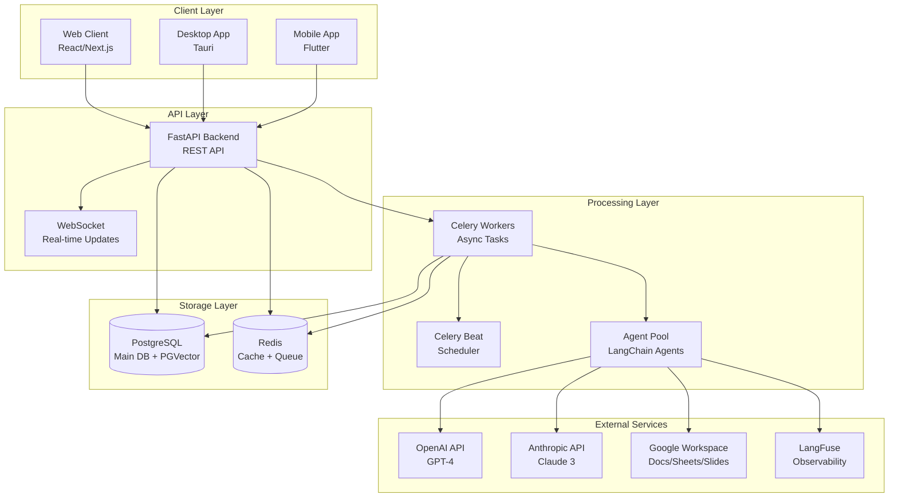

### Key Components

| Component | Technology | Purpose |
|-----------|-----------|---------|
| **FastAPI Backend** | Python 3.11+ | REST API, request handling |
| **Celery Workers** | Celery 5.3+ | Asynchronous task processing |
| **PostgreSQL** | PostgreSQL 15+ | Primary data store + vector search |
| **Redis** | Redis 7+ | Task queue, caching, pub/sub |
| **LangChain** | LangChain 0.1+ | Agent orchestration framework |
| **LangFuse** | LangFuse 2.6+ | LLM observability & tracing |

---

## Backend Architecture

### FastAPI Application Structure

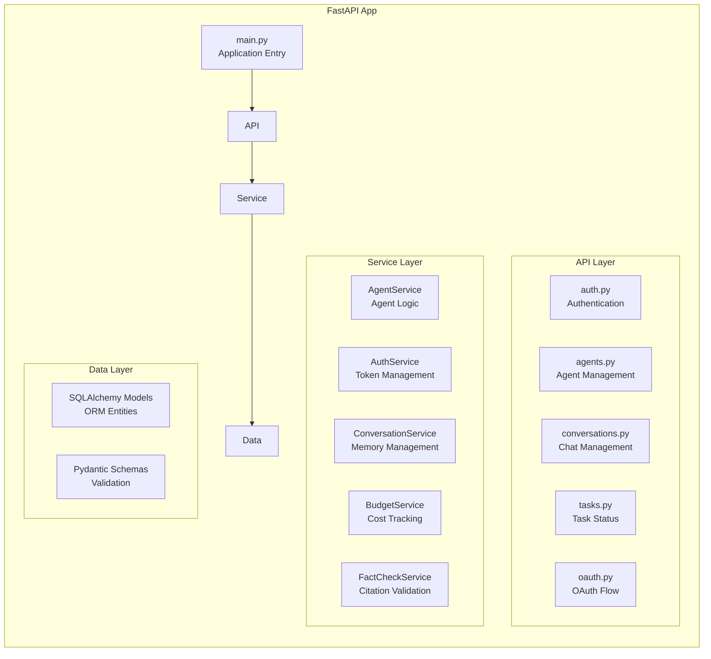

### Directory Structure

```
backend/
├── app/
│   ├── main.py                 # FastAPI application
│   ├── database.py             # DB connection
│   ├── api/                    # API endpoints
│   │   ├── v1/
│   │   │   ├── auth.py         # /api/v1/auth/*
│   │   │   ├── agents.py       # /api/v1/agents/*
│   │   │   ├── conversations.py # /api/v1/conversations/*
│   │   │   ├── tasks.py        # /api/v1/tasks/*
│   │   │   ├── oauth.py        # /api/v1/oauth/*
│   │   │   └── budget.py       # /api/v1/budget/*
│   ├── agents/                 # Agent implementations
│   │   ├── base_agent.py       # BaseAgent class
│   │   ├── research_agent.py   # Research Agent
│   │   ├── docs_agent.py       # Google Docs Agent
│   │   ├── sheets_agent.py     # Google Sheets Agent
│   │   └── slides_agent.py     # Google Slides Agent
│   ├── services/               # Business logic
│   │   ├── agent_service.py
│   │   ├── auth_service.py
│   │   ├── conversation_service.py
│   │   ├── budget_service.py
│   │   └── fact_check_service.py
│   ├── tasks/                  # Celery tasks
│   │   ├── agent_tasks.py      # Agent execution
│   │   ├── oauth_tasks.py      # Token rotation
│   │   └── budget_tasks.py     # Budget monitoring
│   ├── models/                 # Database models
│   │   ├── user.py
│   │   ├── agent.py
│   │   ├── conversation.py
│   │   ├── task.py
│   │   └── oauth.py
│   ├── schemas/                # Pydantic schemas
│   ├── core/                   # Core utilities
│   │   ├── config.py           # Settings
│   │   ├── security.py         # Auth helpers
│   │   ├── langfuse_config.py  # LangFuse setup
│   │   └── encryption.py       # Token encryption
│   ├── memory/                 # Memory management
│   │   ├── memory_manager.py   # Unified memory
│   │   ├── conversation_memory.py
│   │   └── vector_memory.py
│   ├── tools/                  # Agent tools
│   │   ├── google_tools.py     # Workspace tools
│   │   ├── search_tools.py     # Web search
│   │   └── weather_tools.py    # Weather API
│   └── prompts/                # Agent prompts
│       ├── research_prompts.py
│       ├── docs_prompts.py
│       ├── sheets_prompts.py
│       └── slides_prompts.py
```

---

## Agent Architecture

### Agent Orchestration Flow

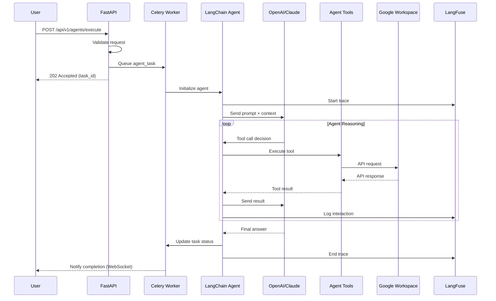

### Agent Types & Capabilities

```mermaid
graph TD
    BaseAgent[BaseAgent<br/>LangChain Framework]
    
    BaseAgent --> Research[ResearchAgent<br/>Web Search & Analysis]
    BaseAgent --> Docs[DocsAgent<br/>Document Generation]
    BaseAgent --> Sheets[SheetsAgent<br/>Data & Analytics]
    BaseAgent --> Slides[SlidesAgent<br/>Presentations]
    
    Research --> SearchTool[Web Search Tool]
    Research --> WeatherTool[Weather Tool]
    Research --> CiteTool[Citation Tool]
    
    Docs --> DocsTool[Google Docs API]
    Docs --> CiteTool
    Docs --> StyleTool[Document Styling]
    
    Sheets --> SheetsTool[Google Sheets API]
    Sheets --> ChartTool[Chart Generation]
    Sheets --> FormulaTool[Formula Tools]
    Sheets --> FormatTool[Cell Formatting]
    Sheets --> PivotTool[Pivot Tables]
    Sheets --> ValidationTool[Data Validation]
    
    Slides --> SlidesTool[Google Slides API]
    Slides --> LayoutTool[Layout Engine]
    Slides --> ThemeTool[Theme Presets]
    Slides --> ImageTool[Image Placement]
```

### Agent Execution Pipeline

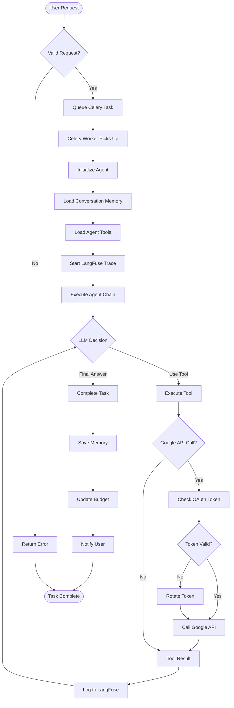

---

## Data Flow

### Request/Response Flow

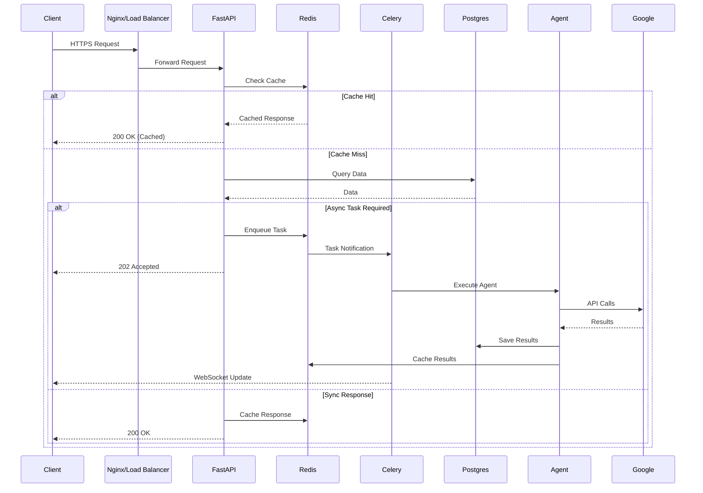

### Memory Management Flow

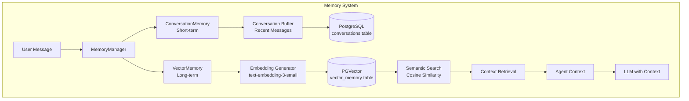

### Budget Tracking Flow

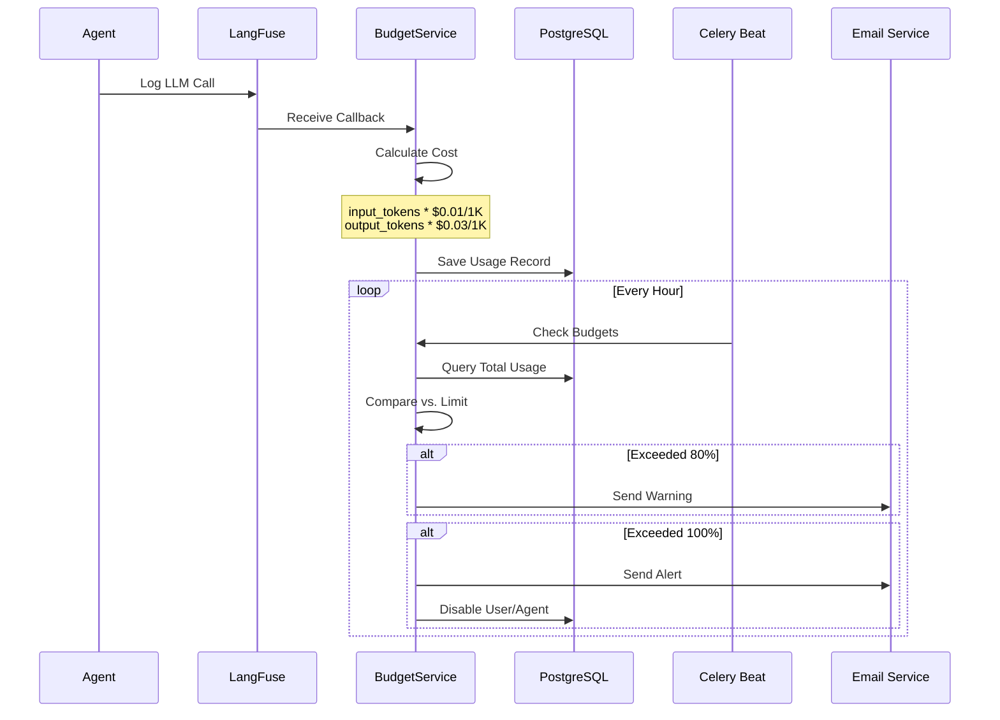

---

## Authentication Flow

### OAuth 2.0 Flow (Google)

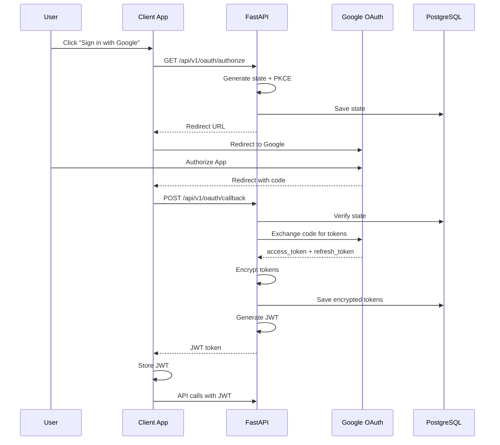

### Token Rotation Flow (Enhanced OAuth)

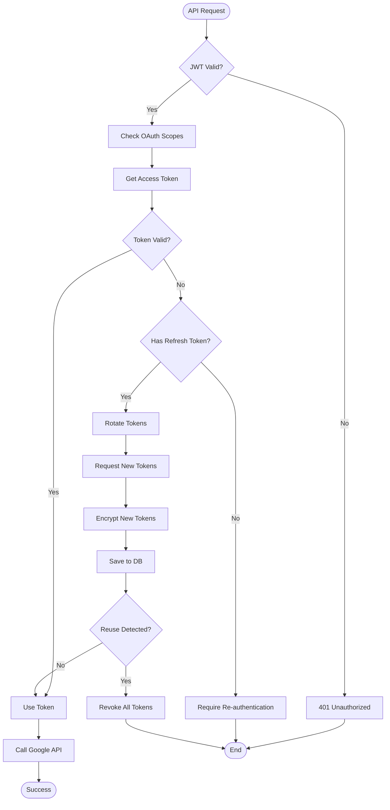

### Multi-Provider OAuth

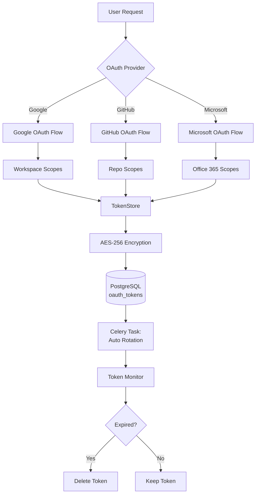

---

## Mobile Architecture

### Flutter App Architecture (MVVM Pattern)

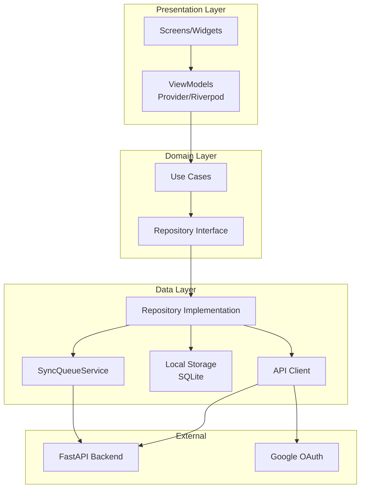

### Offline Sync Architecture

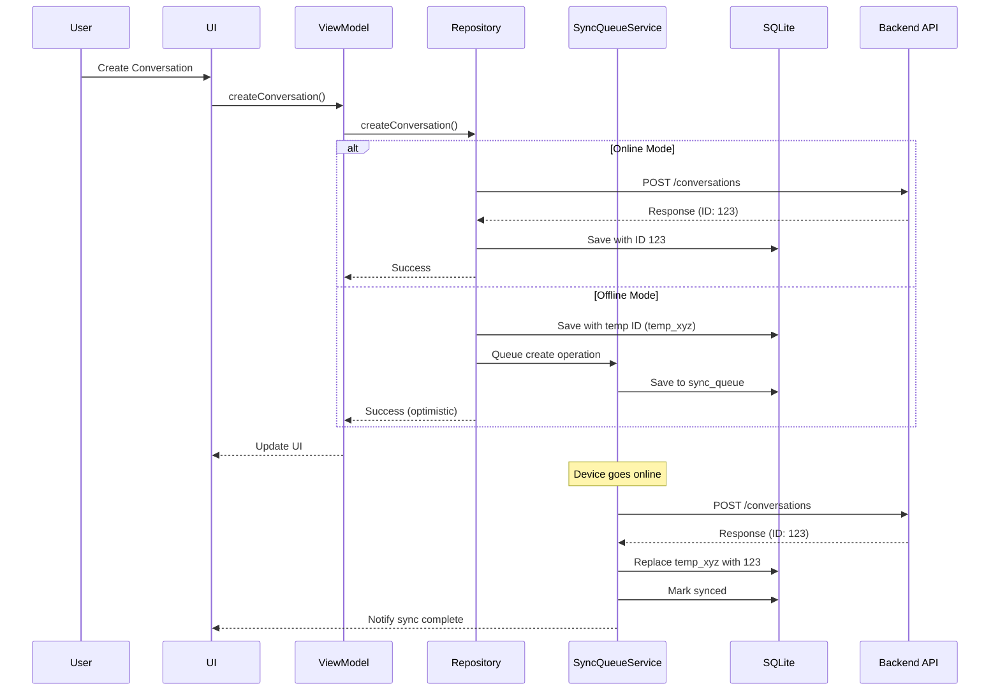

### Mobile Data Flow

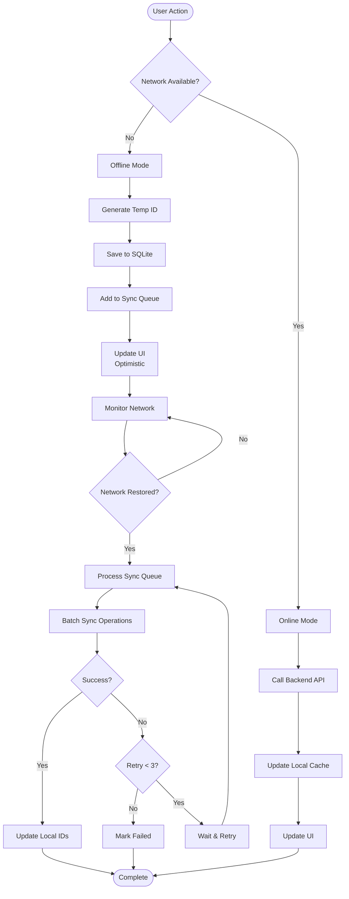

---

## Database Schema

### Core Tables

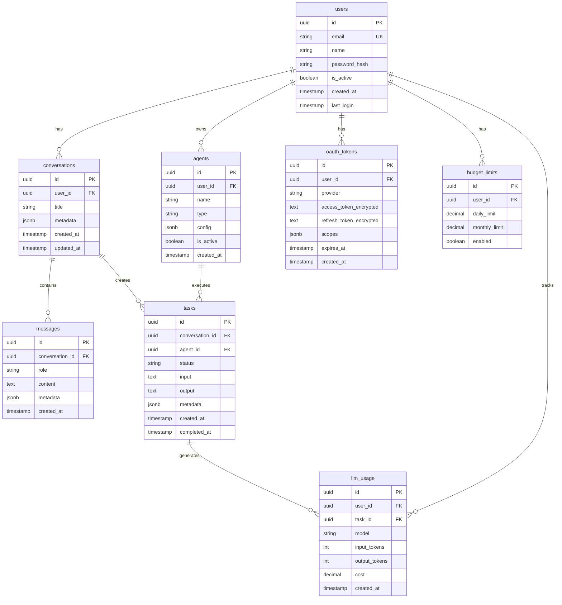

### Vector Memory Schema

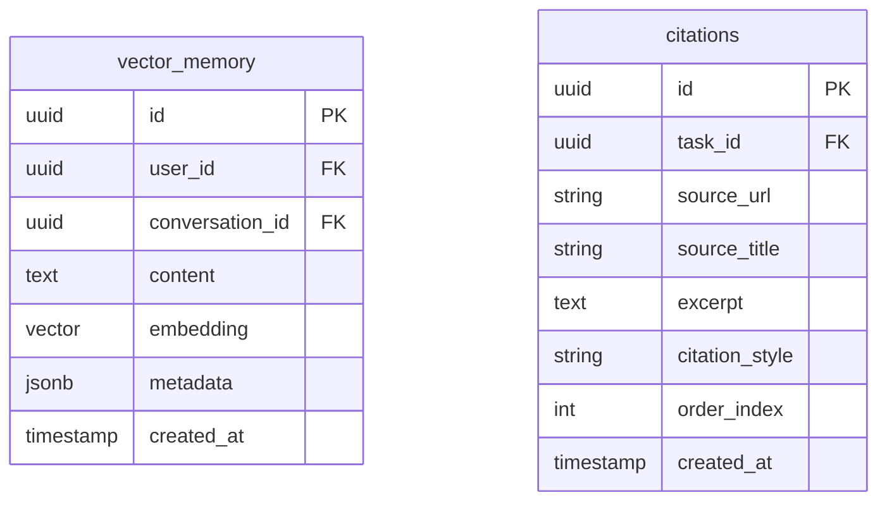

---

## Technology Stack

### Backend Stack

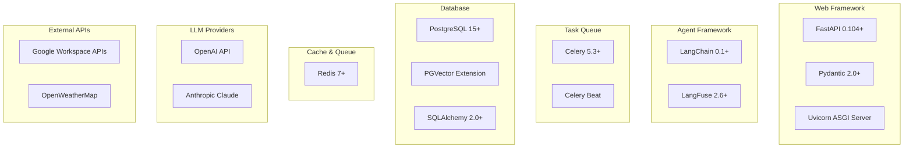

### Frontend Stack

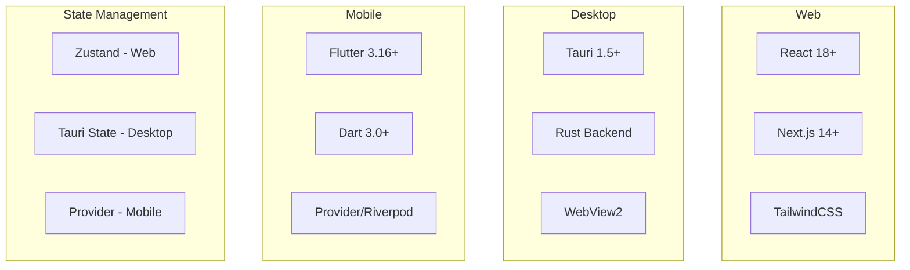

### Deployment Stack

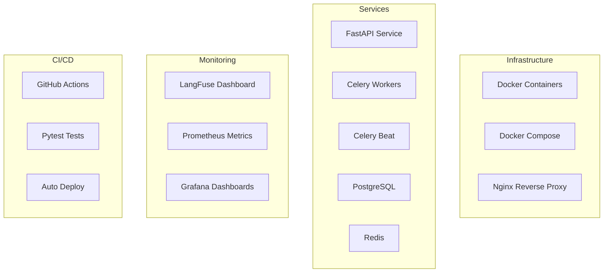

---

## Performance Considerations

### Caching Strategy

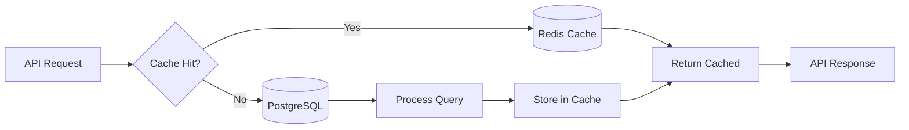

**Cache TTL Policy:**
- User sessions: 24 hours
- Conversation history: 1 hour
- Agent configs: 6 hours
- OAuth tokens: Until expiry
- Search results: 30 minutes

### Scaling Strategy

```mermaid
graph TB
    subgraph "Horizontal Scaling"
        LB[Load Balancer]
        API1[FastAPI Instance 1]
        API2[FastAPI Instance 2]
        API3[FastAPI Instance N]
        
        LB --> API1
        LB --> API2
        LB --> API3
    end
    
    subgraph "Worker Scaling"
        Queue[(Redis Queue)]
        W1[Celery Worker 1]
        W2[Celery Worker 2]
        W3[Celery Worker N]
        
        Queue --> W1
        Queue --> W2
        Queue --> W3
    end
    
    subgraph "Data Layer"
        Master[(PostgreSQL Master)]
        Replica1[(Read Replica 1)]
        Replica2[(Read Replica 2)]
        
        Master --> Replica1
        Master --> Replica2
    end
    
    API1 --> Queue
    API2 --> Queue
    API3 --> Queue
    
    API1 --> Master
    API1 --> Replica1
    API2 --> Replica2
```

---

## Security Architecture

### Security Layers

```mermaid
graph TB
    subgraph "Network Layer"
        HTTPS[HTTPS/TLS 1.3]
        CORS[CORS Policy]
        RateLimit[Rate Limiting]
    end
    
    subgraph "Authentication"
        JWT[JWT Tokens]
        OAuth[OAuth 2.0 + PKCE]
        MFA[MFA Support]
    end
    
    subgraph "Authorization"
        RBAC[Role-Based Access Control]
        Scopes[OAuth Scopes]
        Policies[Resource Policies]
    end
    
    subgraph "Data Security"
        Encryption[AES-256 Encryption]
        Hashing[Argon2 Hashing]
        Tokenization[Token Encryption]
    end
    
    subgraph "API Security"
        Validation[Input Validation]
        Sanitization[SQL Injection Prevention]
        CSRF[CSRF Protection]
    end
    
    HTTPS --> JWT
    JWT --> RBAC
    RBAC --> Validation
    OAuth --> Encryption
    Encryption --> Tokenization
```

---

## Deployment Architecture

### Production Environment

```mermaid
graph TB
    subgraph "Edge"
        CDN[Cloudflare CDN]
        WAF[Web Application Firewall]
    end
    
    subgraph "Application Layer"
        Nginx[Nginx Load Balancer]
        API1[FastAPI Container 1]
        API2[FastAPI Container 2]
        Worker1[Celery Worker 1]
        Worker2[Celery Worker 2]
    end
    
    subgraph "Data Layer"
        PostgresPrimary[(PostgreSQL Primary)]
        PostgresReplica[(PostgreSQL Replica)]
        RedisCluster[(Redis Cluster)]
    end
    
    subgraph "External"
        S3[S3 Storage]
        CloudWatch[CloudWatch Logs]
        LangFuse[LangFuse SaaS]
    end
    
    CDN --> WAF
    WAF --> Nginx
    Nginx --> API1
    Nginx --> API2
    API1 --> Worker1
    API2 --> Worker2
    API1 --> PostgresPrimary
    API2 --> PostgresReplica
    Worker1 --> RedisCluster
    Worker2 --> RedisCluster
    API1 --> S3
    Worker1 --> CloudWatch
    Worker1 --> LangFuse
```

---

## Monitoring & Observability

### Observability Stack

```mermaid
graph LR
    subgraph "Application"
        FastAPI[FastAPI]
        Celery[Celery Workers]
        Agents[LangChain Agents]
    end
    
    subgraph "Metrics"
        Prometheus[Prometheus]
        Grafana[Grafana]
    end
    
    subgraph "Logging"
        Logs[Application Logs]
        CloudWatch[CloudWatch/ELK]
    end
    
    subgraph "Tracing"
        LangFuse[LangFuse]
        OpenTelemetry[OpenTelemetry]
    end
    
    FastAPI --> Prometheus
    Celery --> Prometheus
    Prometheus --> Grafana
    
    FastAPI --> Logs
    Celery --> Logs
    Logs --> CloudWatch
    
    Agents --> LangFuse
    FastAPI --> OpenTelemetry
```

**Key Metrics Tracked:**
- Request latency (p50, p95, p99)
- Error rates (4xx, 5xx)
- Agent execution time
- LLM token usage & cost
- Task queue depth
- Database query performance
- Cache hit ratio

---

## Future Architecture Enhancements

### Planned Improvements

1. **GraphQL API Layer** - More flexible queries for complex clients
2. **Event-Driven Architecture** - Kafka/RabbitMQ for event streaming
3. **Service Mesh** - Istio for microservices communication
4. **Multi-Region Deployment** - Global CDN + database replication
5. **ML Model Serving** - Custom fine-tuned models via TensorFlow Serving
6. **Real-time Collaboration** - Operational Transform for multi-user editing
7. **Vector Database Migration** - Pinecone/Weaviate for advanced semantic search

---

## References

- [FastAPI Documentation](https://fastapi.tiangolo.com/)
- [LangChain Documentation](https://python.langchain.com/)
- [Celery Documentation](https://docs.celeryproject.org/)
- [PostgreSQL Documentation](https://www.postgresql.org/docs/)
- [Google Workspace APIs](https://developers.google.com/workspace)
- [LangFuse Documentation](https://langfuse.com/docs)

---

**Document Version**: 1.0  
**Last Review**: 2026-03-01  
**Next Review**: 2026-04-01
